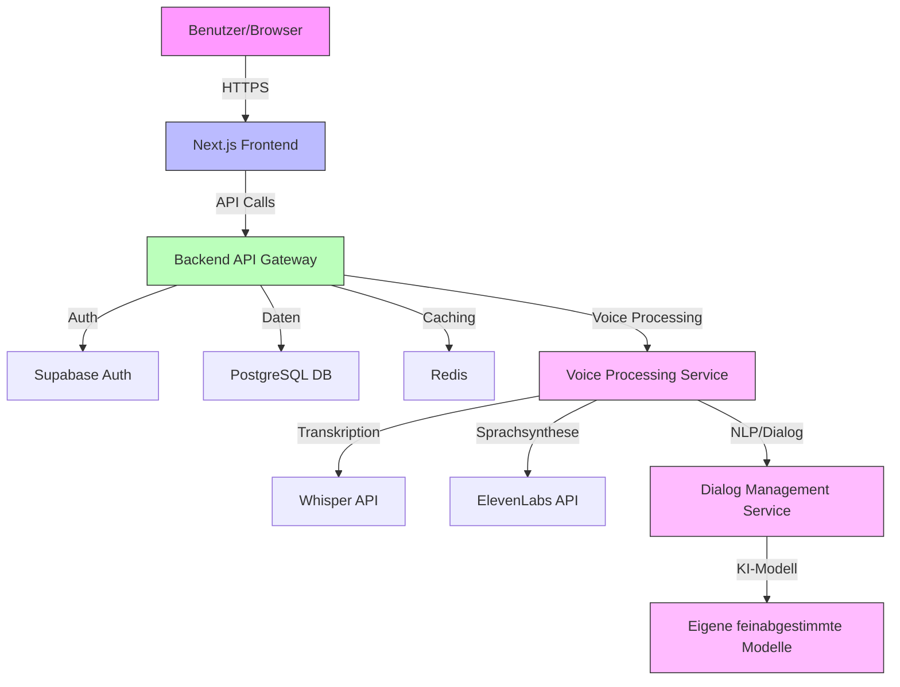
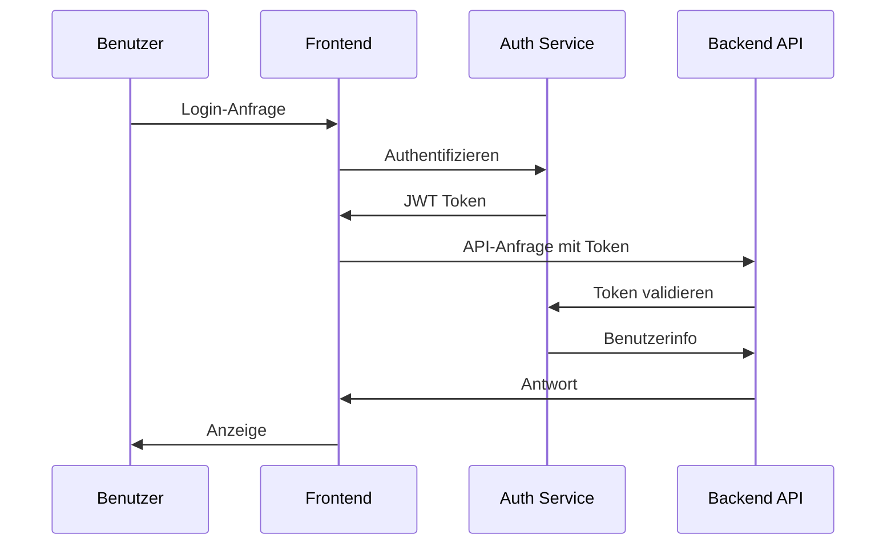
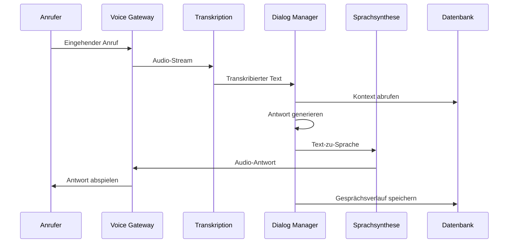

# Architektur für JASZ-AI

<version>1.0.0</version>

## Status: Approved

## Technische Zusammenfassung

Die JASZ-AI-Architektur definiert eine moderne, skalierbare und sichere Plattform für KI-gestützte Voice-Agents. Das System verwendet eine Microservices-Architektur mit einer klaren Trennung zwischen Frontend und Backend, um maximale Flexibilität, Wartbarkeit und Skalierbarkeit zu gewährleisten. Die Architektur ist darauf ausgelegt, hohe Verfügbarkeit, Datenschutz gemäß DSGVO und optimale Leistung zu bieten.

## Technologie-Tabelle

| Technologie      | Beschreibung                                                |
|------------------|-------------------------------------------------------------|
| Next.js          | React-Framework für serverseitiges Rendering und API-Routes |
| React            | Frontend-Bibliothek für Benutzeroberflächen                |
| TypeScript       | Typisierte Programmiersprache für robustere Anwendungen    |
| Tailwind CSS     | Utility-First CSS-Framework für schnelles UI-Design        |
| Shadcn UI        | Komponenten-Bibliothek für konsistentes Design             |
| Framer Motion    | Bibliothek für Animationen und Übergänge                   |
| Node.js          | JavaScript-Laufzeitumgebung für Backend-Services           |
| Python           | Programmiersprache für KI/ML-Komponenten                   |
| FastAPI          | Python-Framework für schnelle API-Entwicklung              |
| Supabase         | Backend-as-a-Service für Authentifizierung und Datenbank   |
| PostgreSQL       | Relationale Datenbank für strukturierte Daten              |
| Redis            | In-Memory-Datenbank für Caching und Echtzeit-Funktionen    |
| Digital Ocean    | Cloud-Hosting-Plattform (deutsche Rechenzentren)           |
| Docker           | Container-Plattform für konsistente Entwicklung/Deployment |
| GitHub Actions   | CI/CD-Pipeline für automatisierte Tests und Deployment     |
| Whisper          | Spracherkennungsmodell für Transkription                   |
| ElevenLabs       | API für hochwertige Sprachsynthese                         |

## Architektur-Diagramme

### System-Übersicht



### Benutzer-Authentifizierung



### Voice-Agent-Prozess



## Datenmodelle

### Benutzer-Schema

```json
{
  "id": "uuid",
  "email": "string",
  "name": "string",
  "company": "string",
  "plan": "string",
  "created_at": "timestamp",
  "updated_at": "timestamp"
}
```

### Voice-Agent-Schema

```json
{
  "id": "uuid",
  "user_id": "uuid",
  "name": "string",
  "voice_id": "string",
  "language": "string",
  "greeting": "string",
  "personality": "string",
  "knowledge_base": "json",
  "created_at": "timestamp",
  "updated_at": "timestamp"
}
```

### Anruf-Schema

```json
{
  "id": "uuid",
  "agent_id": "uuid",
  "caller_number": "string",
  "caller_name": "string",
  "start_time": "timestamp",
  "end_time": "timestamp",
  "duration": "integer",
  "transcript": "text",
  "summary": "text",
  "actions": "json",
  "status": "string"
}
```

## Projektstruktur

```
/
├── /app                    # Next.js App Router
│   ├── /api                # API-Routen
│   ├── /(auth)             # Authentifizierungsseiten
│   ├── /(marketing)        # Öffentliche Marketing-Seiten
│   └── /(dashboard)        # Geschützte Dashboard-Seiten
├── /components             # React-Komponenten
│   ├── /ui                 # UI-Komponenten (Shadcn)
│   ├── /forms              # Formular-Komponenten
│   ├── /layouts            # Layout-Komponenten
│   └── /motion-primitives  # Animationskomponenten
├── /lib                    # Hilfsfunktionen und Utilities
│   ├── /supabase           # Supabase-Client und Funktionen
│   ├── /voice              # Voice-Processing-Funktionen
│   └── /utils              # Allgemeine Hilfsfunktionen
├── /public                 # Statische Assets
├── /styles                 # Globale Styles
├── /types                  # TypeScript-Typdefinitionen
├── /services               # Backend-Services
│   ├── /voice-gateway      # Voice-Gateway-Service
│   ├── /transcription      # Transkriptionsservice
│   ├── /dialog-manager     # Dialog-Management-Service
│   └── /tts                # Text-to-Speech-Service
└── /prisma                 # Datenbankschema und Migrationen
```

## Änderungsprotokoll

| Änderung              | Story-ID | Beschreibung                                  |
|-----------------------|----------|-----------------------------------------------|
| Initiale Architektur  | N/A      | Initiale Systemarchitektur und Dokumentation  | 