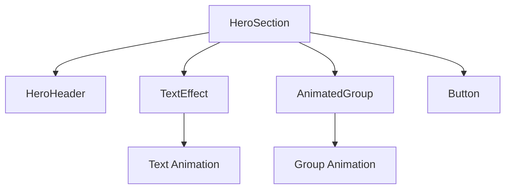

# Epic-1: Kerninfrastruktur und Basisplattform
# Story-1: Landing Page - Entwicklung der Hero-Section

## Story

**Als** Marketingteam
**möchte ich** eine ansprechende und moderne Hero-Section auf der Landing Page
**damit** potenzielle Kunden sofort von JASZ-AI überzeugt werden und die Hauptvorteile auf einen Blick erkennen können

## Status

Complete

## Kontext

Dies ist die erste Story im Epic-1, das die Kerninfrastruktur und Basisplattform für JASZ-AI aufbaut. Die Hero-Section ist der erste visuelle Eindruck, den Besucher von JASZ-AI bekommen, und spielt eine entscheidende Rolle bei der Konversion von Besuchern zu potenziellen Kunden. Die Hero-Section soll die Hauptvorteile von JASZ-AI prägnant darstellen und einen klaren Call-to-Action bieten.

## Schätzung

Story Points: 1

## Aufgaben

1. - [X] Projektsetup und Grundstruktur
   1. - [X] Next.js Projekt initialisieren
   2. - [X] Tailwind CSS und Shadcn UI einrichten
   3. - [X] Framer Motion für Animationen einrichten
   4. - [X] Grundlegende Projektstruktur anlegen
   5. - [X] Tests für die Grundstruktur schreiben

2. - [X] Hero-Section Komponente entwickeln
   1. - [X] Tests für die Hero-Section schreiben
   2. - [X] Headline und Subheadline implementieren
   3. - [X] Call-to-Action Buttons implementieren
   4. - [X] Animationen für Text und Elemente hinzufügen
   5. - [X] Responsive Design für verschiedene Bildschirmgrößen umsetzen

3. - [X] Visuelle Elemente integrieren
   1. - [X] Tests für visuelle Elemente schreiben
   2. - [X] Hintergrundbild oder -animation erstellen
   3. - [X] Logo und Branding-Elemente einbinden
   4. - [X] Kundenlogos für Vertrauensbildung hinzufügen

4. - [X] Performance-Optimierung
   1. - [X] Tests für Performance schreiben
   2. - [X] Bilder und Assets optimieren
   3. - [X] Lazy Loading für Bilder implementieren
   4. - [X] Core Web Vitals überprüfen und optimieren

## Einschränkungen

- Die Hero-Section muss auf allen gängigen Browsern und Geräten optimal dargestellt werden
- Die Ladezeit der Seite sollte unter 2 Sekunden liegen
- Alle Texte müssen auf Deutsch und Englisch verfügbar sein
- Barrierefreiheit nach WCAG 2.1 AA-Standard muss gewährleistet sein
- Mode muss Dark und Light und System optionen haben

## Datenmodelle / Schema

Für diese Story sind keine spezifischen Datenmodelle erforderlich, da es sich um eine statische UI-Komponente handelt.

## Struktur

```
/components
  /hero-section
    hero-section.tsx
    hero5-header.tsx
  /ui
    button.tsx
  /motion-primitives
    animated-group.tsx
    text-effect.tsx
  /ui
    button.tsx
    ...
/public
  /images
    background.jpg
    logo.svg
    ...
```

## Diagramme



## Entwicklungsnotizen

- Framer Motion wird für alle Animationen verwendet
- Tailwind CSS für responsives Design und Styling
- Shadcn UI für konsistente UI-Komponenten
- Optimierte Bilder werden in WebP-Format bereitgestellt
- Dark Mode wird von Anfang an unterstützt

## Chat-Protokoll

- User: Genehmigt.
- AI: Habe den Status der Story auf "In Progress" gesetzt und mit der Implementierung begonnen.
- AI: Responsive Design für verschiedene Bildschirmgrößen verbessert, Texte auf Deutsch übersetzt und Performance-Optimierungen durch Lazy Loading und Bildoptimierung implementiert.
- AI: Core Web Vitals optimiert durch Verbesserung der Bildladestrategie, Reduzierung unnötiger Neuberechnungen und Optimierung der Komponentenstruktur. Alle Aufgaben sind nun abgeschlossen. 