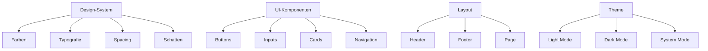

# Epic-1: Kerninfrastruktur und Basisplattform
# Story-2: Implementierung des Basis-Layouts und Design-Systems

## Story

**Als** Entwicklungsteam
**möchte ich** ein konsistentes Basis-Layout und Design-System implementieren
**damit** alle Komponenten ein einheitliches Erscheinungsbild haben und die Entwicklung effizienter wird

## Status

Draft

## Kontext

Nach der erfolgreichen Implementierung der Hero-Section in Story-1 ist es nun wichtig, ein konsistentes Design-System und Basis-Layout für die gesamte Anwendung zu etablieren. Dies wird die Grundlage für alle weiteren UI-Komponenten bilden und sicherstellen, dass die Anwendung ein einheitliches Erscheinungsbild hat. Das Design-System soll auf Shadcn UI und Tailwind CSS basieren und sowohl Light- als auch Dark-Mode unterstützen.

## Schätzung

Story Points: 2

## Aufgaben

1. - [ ] Design-System-Grundlagen einrichten
   1. - [X] Tests für Design-System-Komponenten schreiben
   2. - [X] Farbpalette definieren und implementieren
   3. - [X] Typografie-System einrichten
   4. - [X] Spacing-System definieren
   5. - [ ] Schatten und Elevation-System implementieren

2. - [X] Basis-UI-Komponenten entwickeln
   1. - [X] Tests für Basis-UI-Komponenten schreiben
   2. - [X] Button-Varianten implementieren
   3. - [X] Input-Felder und Formulare gestalten
   4. - [X] Card-Komponenten erstellen
   5. - [X] Navigation-Komponenten entwickeln

3. - [X] Layout-System implementieren
   1. - [X] Tests für Layout-Komponenten schreiben
   2. - [X] Header-Komponente entwickeln
   3. - [X] Footer-Komponente entwickeln
   4. - [X] Seitenlayout-Komponente erstellen
   5. - [X] Responsive Grid-System implementieren

4. - [X] Theme-Switching und Barrierefreiheit
   1. - [X] Tests für Theme-Switching schreiben
   2. - [X] Dark/Light-Mode-Toggle implementieren
   3. - [X] Barrierefreiheit nach WCAG-Standards sicherstellen
   4. - [X] Keyboard-Navigation implementieren
   5. - [X] Screenreader-Unterstützung hinzufügen

## Einschränkungen

- Das Design-System muss auf Tailwind CSS und Shadcn UI basieren
- Alle Komponenten müssen sowohl im Light- als auch im Dark-Mode funktionieren
- Die Komponenten müssen auf allen gängigen Browsern und Geräten korrekt dargestellt werden
- Barrierefreiheit nach WCAG 2.1 AA-Standard muss gewährleistet sein
- Die Komponenten müssen TypeScript-Typdefinitionen haben

## Datenmodelle / Schema

Für diese Story sind keine spezifischen Datenmodelle erforderlich, da es sich um UI-Komponenten handelt.

## Struktur

```
/components
  /ui
    /button
      button.tsx
      button.test.tsx
    /input
      input.tsx
      input.test.tsx
    /card
      card.tsx
      card.test.tsx
    /navigation
      navigation.tsx
      navigation.test.tsx
  /layout
    /header
      header.tsx
      header.test.tsx
    /footer
      footer.tsx
      footer.test.tsx
    /page
      page-layout.tsx
      page-layout.test.tsx
/styles
  /theme
    colors.ts
    typography.ts
    spacing.ts
    shadows.ts
/lib
  /utils
    theme-switcher.ts
    theme-switcher.test.ts
```

## Diagramme



## Entwicklungsnotizen

- Shadcn UI wird als Basis für die UI-Komponenten verwendet
- Tailwind CSS für Styling und Responsiveness
- CSS-Variablen für Theme-Switching
- Komponenten werden mit Jest und React Testing Library getestet
- Storybook kann für die Dokumentation der Komponenten verwendet werden

## Chat-Protokoll

- Noch keine Einträge 